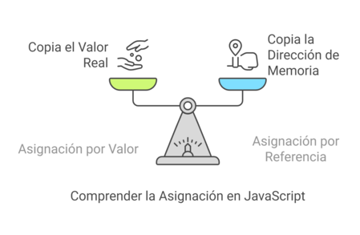

# Clase: Acceso a Objetos con Diferentes Tipos de Funciones en JavaScript

## 1. Introducción
En esta clase aprenderás cómo acceder a propiedades de objetos en JavaScript utilizando tres tipos principales de funciones: **funciones declaradas**, **funciones expresadas**, y **arrow functions**.

---

## 2. ¿Qué es un objeto y cómo se accede a sus propiedades?

En JavaScript, un **objeto** es una colección de pares clave-valor. Cada clave (o propiedad) tiene un nombre y un valor asociado.

Ejemplo de objeto:
```js
const producto = {
  id: 1,
  nombre: "Camisa",
  precio: 25000
};
```

Para acceder a sus propiedades podemos usar la **notación de punto** o la **notación de corchetes**:
```js
console.log(producto.nombre); // Camisa
console.log(producto["precio"]); // 25000
```

Cuando una función recibe un parámetro como `obj`, está recibiendo una **referencia al objeto**. `obj` es simplemente un nombre de variable, tú puedes llamarlo como quieras, lo importante es que representa un objeto con propiedades.

```js
function mostrarNombre(obj) {
  console.log(obj.nombre); // Camisa
}

mostrarNombre(producto); // undefined
```

```js
function mostrarNombre(obj){
    return obj.nombre;
}

mostrarNombre(producto); // Camisa
```

Aquí `obj` apunta al objeto `producto`, por eso podemos acceder a `obj.nombre`.

   

Ejemplo de Asignación por Referencia

Consideremos el siguiente ejemplo:   

```js
let obj1 = { nombre: "Juan" };
let obj2 = obj1;
```

En este caso, obj1 es un objeto que contiene una propiedad nombre. Cuando asignamos obj1 a obj2, no se crea una copia del objeto. En su lugar, obj2 apunta a la misma referencia en memoria que obj1. Esto significa que cualquier cambio realizado en obj2 también afectará a obj1:

```js
obj2.nombre = "Pedro";
console.log(obj1.nombre); // Salida: "Pedro"
```

Aquí, al cambiar la propiedad nombre de obj2, también se refleja en obj1, ya que ambos apuntan al mismo objeto.

## Creación de Nuevos Objetos   

Si deseas crear un nuevo objeto que sea una copia del original, puedes utilizar métodos como `Object.assign()` o el operador de propagación `(...)`:

```js
let obj3 = { ...obj1 }; // Usando el operador de propagación
obj3.nombre = "María";
console.log(obj1.nombre); // Salida: "Pedro"
```

Entender cómo `obj` en JavaScript apunta a un objeto es fundamental para trabajar eficazmente con este lenguaje. La asignación por referencia permite que múltiples variables apunten al mismo objeto, lo que puede ser útil, pero también puede llevar a confusiones si no se maneja adecuadamente. Al utilizar métodos de copia, puedes evitar efectos secundarios no deseados y trabajar con objetos de manera más segura.
---

## 3. Accediendo a objetos con diferentes tipos de funciones

### 3.1 Funciones Declaradas

Las funciones declaradas son aquellas que se definen con la palabra clave `function` y un nombre. Se "elevan" (hoisting), lo que significa que puedes usarlas antes de declararlas.

```js
function mostrarNombre(obj) {
  console.log("Nombre:", obj.nombre);
}

const persona = { nombre: "Ana" };
mostrarNombre(persona); // Nombre: Ana
```

### 3.2 Funciones Expresadas

Las funciones expresadas se asignan a una variable. No se elevan como las declaradas.

```js
const mostrarEdad = function(obj) {
  console.log("Edad:", obj.edad);
};

const persona = { edad: 28 };
mostrarEdad(persona); // Edad: 28
```

### 3.3 Arrow Functions (Funciones Flecha)

Las arrow functions tienen una sintaxis más corta y no tienen su propio `this`, lo que puede ser útil (o peligroso) dependiendo del contexto.

```js
const mostrarCiudad = (obj) => {
  console.log("Ciudad:", obj.ciudad);
};

const persona = { ciudad: "Cartagena" };
mostrarCiudad(persona); // Ciudad: Cartagena
```

---

## 4. Diferencias Clave

| Característica     | Declaradas              | Expresadas               | Arrow Functions        |
|--------------------|--------------------------|---------------------------|-------------------------|
| **Hoisting**       | Sí                      | No                       | No                     |
| **`this` propio**  | Sí                      | Sí                       | **No** (hereda el `this` del contexto padre) |
| **Sintaxis**       | Verbosa                 | Verbosa                  | Concisa                |
| **Uso común**      | Funciones generales     | Callbacks, funciones internas | Funciones cortas, callbacks, `map`, `filter`, etc. |

---

## 5. ¿Cuándo usar cada tipo?

- **Declaradas:** Buenas para funciones reutilizables y cuando necesitas que estén disponibles antes de ser definidas.
- **Expresadas:** Útiles para control más explícito del alcance y orden.
- **Arrow functions:** Perfectas para funciones cortas y callbacks, especialmente cuando quieres que `this` se mantenga.

---

## 6. Accediendo a objetos en React (Explicación básica)

En React, trabajamos mucho con **props** y **state**, los cuales son objetos. Usamos funciones (comúnmente arrow functions) para acceder y mostrar estos datos en el componente.

### Ejemplo con props (que es un objeto):
```jsx
function Saludo(props) {
  return <h1>Hola, {props.nombre}</h1>;
}

// Uso:
<Saludo nombre="Rick" />
```
Aquí `props` es un objeto, y accedemos a la propiedad `nombre` con `props.nombre`.

### Ejemplo con desestructuración (una forma común en React):
```jsx
function Saludo({ nombre }) {
  return <h1>Hola, {nombre}</h1>;
}
```
En este caso desestructuramos el objeto `props` directamente en los parámetros de la función.

### Arrow function con props:
```jsx
const Saludo = ({ nombre }) => <h1>Hola, {nombre}</h1>;
```

Este patrón es muy común en componentes funcionales. Aunque el componente es una función, accedemos a `props` igual que a cualquier objeto en JavaScript.

---

## 7. Buenas prácticas y errores comunes

### Buenas prácticas
- Usa **arrow functions** para callbacks y funciones cortas.
- Prefiere **funciones declaradas** para lógica principal o reutilizable.
- Sé claro con el uso del `this`. Recuerda que las arrow functions no lo redefinen.

### Errores comunes
- Asumir que una arrow function tiene su propio `this`.
- Usar funciones expresadas o arrow antes de declararlas (por el hoisting).
- Confundir la sintaxis de arrow functions con funciones declaradas.

---

## 8. Ejercicios prácticos (ver archivo `.js` asociado)

- Acceder a propiedades de objetos usando diferentes tipos de funciones.
- Mostrar comportamiento del `this` en cada una.
- Convertir funciones de un tipo a otro y analizar el resultado.
