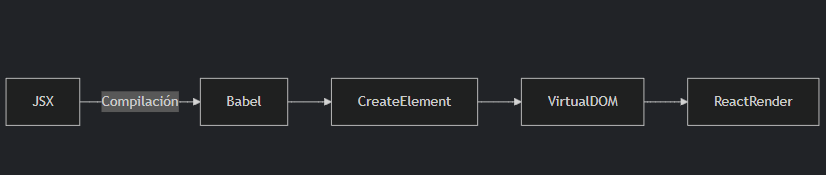

# REACT


---   

🎯 Objetivo
Aprender los fundamentos de React:

- ¿Qué es React?

- ¿Qué es JSX?

- ¿Qué son los componentes?

- ¿Qué son y cómo funcionan las props?

- ¿Qué es el estado (state) y cómo se usa?

- Cómo manejar eventos y renderizar listas

React es una biblioteca (no un framework) de JavaScript diseñada para construir interfaces de usuario (UI) de manera declarativa, eficiente y flexible. Fue creada originalmente por equipos de Facebook e Instagram, y hoy es un proyecto open source mantenido por una comunidad global de desarrolladores.

## Programación declarativa vs. imperativa   

React se basa en un enfoque declarativo, donde le indicamos qué queremos lograr (y la biblioteca se encarga del cómo). Esto contrasta con el estilo imperativo, donde debemos especificar paso a paso cada instrucción.

## 🤔 ¿Qué significa eso?   

- Reactiva: Si cambian los datos, la vista se actualiza automáticamente.

- Declarativa: En vez de decirle paso a paso al navegador cómo dibujar algo, le decimos qué queremos que aparezca en cada momento, y React se encarga del resto.

Ejemplo en código:

```js
const numbers = [4, 2, 3, 6];

// Enfoque imperativo (¿CÓMO?):  
let total = 0;  
for (let i = 0; i < numbers.length; i++) {  
  total += numbers[i];  
}  

// Enfoque declarativo (¿QUÉ?):  
let initialValue = 0;
numbers.reduce((prev, current) => prev + current, initialValue); 
```

En React, este principio se aplica al definir qué componentes deben renderizarse (por ejemplo, "muestra un botón rojo") sin preocuparnos por los detalles imperativos del DOM.   
---   
## 🔥 ¿Qué es el boilerplate?   

El término boilerplate (o "plantilla inicial") se refiere al código base que genera una herramienta como Vite cuando creas un nuevo proyecto. Incluye:

Estructura de archivos mínima (como `main.jsx`, `App.jsx`).

Configuraciones preestablecidas (`vite.config.js`, dependencias en `package.json`).

Código reusable listo para editar (ej. el componente `App`).

En el caso de `npm init vite`, eliges `React` y `JavaScript`, y Vite te da un proyecto funcional con:   

```bash 
my-react-app/
├── node_modules/
├── src/
│   ├── main.jsx       # Punto de entrada
│   ├── App.jsx        # Componente principal
├── index.html         # HTML base
└── package.json
```

--- 


## 💎 ¿Qué es JSX?   

JSX es una extensión de JavaScript que permite escribir código parecido a HTML dentro de JS. Es más cómodo para escribir interfaces visuales, pero JSX no es HTML, es azúcar sintáctica para ``React.createElement()``.   

- `JSX` significa JavaScript XML. Es una extensión de sintaxis que combina JavaScript con una estructura similar a `XML/HTML`, permitiendo escribir componentes de UI de una manera más intuitiva y declarativa.   
   
- ¿Qué es "azúcar sintáctica"?   
El término azúcar sintáctica se refiere a una sintaxis más amigable y legible que "endulza" la escritura de código, pero que en realidad se traduce (o compila) a una forma más compleja o verbosa detrás de escenas. En el caso de JSX, este se convierte en llamadas a ``React.createElement()`` durante la compilación.   

- ¿De dónde sale `React.createElement()`?   
Origen: Es una función fundamental de la librería React, que crea elementos del Virtual DOM (la representación en memoria de la UI).

Función: Toma tres argumentos principales:

1. Tipo (string/componente): Ej. `"div"`, `MyComponent.`
2. Props (objeto/null): Atributos o propiedades del elemento.   
3. Children (opcional): Hijos del elemento (texto, otros elementos, etc.).   

🔹 Ejemplo de transformación:   

```js
// JSX:
const element = <h1 className="title">Hola Mundo</h1>;

// Se convierte en:
const element = React.createElement(
  "h1",
  { className: "title" },
  "Hola Mundo"
);
```   

Resultado: Ambas formas generan el mismo objeto JavaScript que describe la estructura de la UI para React.   

JSX es una abstracción que simplifica la creación de interfaces, pero siempre termina siendo código JavaScript puro. 🚀   


## 🔷 Ejemplo: HTML → JSX   

1. HTML tradicional:   

```HTML
<div class="container">
  <h1 id="title">¡Hola React!</h1>
  <p>Esto es un párrafo con <strong>énfasis</strong>.</p>
  <button onclick="alert('Click')">Presióname</button>
</div>
```   

El código anterior se debe ver como sigue:   

<div class="container">
  <h1 id="title">¡Hola React!</h1>
  <p>Esto es un párrafo con <strong>énfasis</strong>.</p>
  <button onclick="alert('Click')">Presióname</button>
</div>   

   
---   


2. Equivalente en JSX:   

```jsx
<div className="container">
  <h1 id="title">¡Hola React!</h1>
  <p>Esto es un párrafo con <strong>énfasis</strong>.</p>
  <button onClick={() => alert('Click')}>Presióname</button>
</div>
```   


## 🔑 Diferencias clave:   

1. Atributos:

`class` → `className` (porque class es palabra reservada en JS).

`onclick` → `onClick` (eventos en camelCase).   

2. Eventos:

En JSX, los eventos reciben `funciones` (no strings como en HTML):   

```js
<button onClick={() => alert('Click')}> ... </button>
```   

3. Valores dinámicos:

En `JSX`, usas `{}` para insertar expresiones JavaScript:   

```js
<p>Saludo: {nombreUsuario}</p>
```   

4. Etiquetas autocerradas:

En JSX, las etiquetas sin contenido deben cerrarse con />:

```jsx

```

## ⚡ Cómo se compila JSX (bajo el capó):
El JSX del ejemplo se convierte en:   

```jsx
React.createElement(
  "div",
  { className: "container" },
  React.createElement("h1", { id: "title" }, "¡Hola React!"),
  React.createElement("p", null, "Esto es un párrafo con ", React.createElement("strong", null, "énfasis"), "."),
  React.createElement("button", { onClick: () => alert('Click') }, "Presióname")
);
```   

## 🕵️ ¿Dónde está `React.createElement()`?   

¡Está oculto pero presente! Lo que ocurre es que JSX se compila automáticamente a ``React.createElement()`` durante el proceso de construcción (build). Vite usa Babel (o su equivalente en ESBuild) para esta transformación.

🔍 Explicación detallada:
Tu código en main.jsx:

```jsx
ReactDOM.createRoot(document.getElementById('root')).render(
  <React.StrictMode>
    <App />
  </React.StrictMode>
);
```   

Se compila a esto (simplificado):   

```jsx 
ReactDOM.createRoot(document.getElementById('root')).render(
  React.createElement(
    React.StrictMode,
    null,
    React.createElement(App, null)
  )
);
```   

## Claves:   

**JSX ≠ HTML**: Todo lo que parece HTML (<App />, <StrictMode>) es transformado a ``React.createElement()`.`

Herramientas como Vite/Babel hacen esta conversión automáticamente (no necesitas ver el código transformado).

¿Por qué no lo ves?: El código compilado se genera en memoria durante el desarrollo o en la carpeta dist al hacer `npm run build`.   

## 🛠️ Cómo ver la transformación:
Si quieres verlo en acción:

- Usa el [Babel Repl](https://babeljs.io/repl#?browsers=defaults%2C%20not%20ie%2011%2C%20not%20ie_mob%2011&build=&builtIns=false&corejs=3.21&spec=false&loose=false&code_lz=Q&forceAllTransforms=false&modules=false&shippedProposals=false&evaluate=false&fileSize=false&timeTravel=false&sourceType=module&lineWrap=true&presets=env%2Creact%2Cstage-2&prettier=false&targets=&version=7.27.0&externalPlugins=&assumptions=%7B%7D) y pega tu JSX.

- O ejecuta `npm run build` y revisa los archivos en `dist/assets/*.js` (busca createElement).      

   


## 📌 Concluimos que:   
`JSX` parece `HTML`, pero es `JavaScript extendido` con reglas específicas para trabajar con `React`. La clave está en recordar que todo se transforma en ``React.createElement()`` al final. 🛠️

--- 

## ¿ QUÉ SON LOS COMPONENTES ? 🧊 🧱  

{width=400px}

Las aplicaciones de React se construyen a partir de piezas independientes de UI llamadas componentes. Un componente de `React` es una `función` de `JavaScript` a la que le puedes agregar un poco de marcado (markup). Los componentes
pueden ser tan pequeños como un botón, o tan grandes como una página entera. Miremos la imagen de abajo, cada cajita con un color particular representa un componente. Esta es una de las muchas formas de poder dividir un solo elemento o `feature` de nuestro sitio. 

Todo en React se construye con componentes. Son como piezas de Lego: pequeños bloques reutilizables que juntos forman una aplicación.

### ¿ Qué debe contener un *_componente_* ?   

Para diseñar componentes es importante tener en cuenta el principio de diseño llamado ***single responsability*** (SRP - Single Responsability Principle) o principio de responsabilidad única. El principio de responsabilidad única o single responsibility establece que un módulo de software debe tener una y solo una razón para cambiar. Esta razón para cambiar es lo que se entiende por responsabilidad.   

{width=300px} 

## *“Reúna las cosas que cambian por las mismas razones. Separe las cosas que cambian por diferentes razones.”*   

Este principio está estrechamente relacionado con los conceptos de acoplamiento y cohesión. Queremos aumentar la cohesión entre las cosas que cambian por las mismas razones y disminuir el acoplamiento entre las cosas que cambian por diferentes razones. Este principio trata sobre limitar el impacto de un cambio.
Si existe más de una razón para cambiar una clase, probablemente tenga más de una responsabilidad. Otro posible “mal olor” es que tenga diferentes comportamientos dependiendo de su estado. Tener más de una responsabilidad también hace que el código sea difícil de leer, testear y mantener. Es decir, hace que el código sea menos flexible.   

Entre las ventajas de aplicar este principio encontramos que, si se necesita hacer algún cambio, éste será fácil de detectar ya que estará aislado en una clase claramente definida y comprensible. Minimizando los efectos colaterales en otras clases. Algunos ejemplos que encontramos en la vida real son:   

- Si cambia la forma en que se compra un artículo, no tendremos que modificar el código responsable de almacenarlo. 
- Si cambia la base de datos, no habrá que arreglar cada pedazo de código donde se utiliza.

## 🛠 Cómo se escribe un componente
💡 Recuerda: Un componente es solo una función de JavaScript que devuelve JSX.   

```js
function Boton() {
  return <button>Haz click</button>;
}
```   

La función anterior se verá así:   


Este componente se puede reutilizar todas las veces que necesitemos ese botón.

## 🧩 Composición de componentes
Los componentes pueden componerse entre sí. Esto significa que un componente puede usar otros componentes dentro de su JSX.

```jsx
function Header() {
  return <h1>Mi sitio web</h1>;
}

function Footer() {
  return <footer>© 2025 RickDev</footer>;
}

function App() {
  return (
    <div>
      <Header />
      <p>Contenido principal</p>
      <Footer />
    </div>
  );
}

```

Esto permite armar UIs más complejas a partir de piezas simples y bien separadas.

## 📦 Props: Personalización de componentes
Podemos hacer que un componente sea dinámico y reutilizable usando props.   

```jsx
function Saludo({ nombre }) {
  return <h2>Hola, {nombre} 👋</h2>;
}

function App() {
  return (
    <div>
      <Saludo nombre="Rick" />
      <Saludo nombre="Morty" />
    </div>
  );
}
```   

## 🧠 Aplicando el SRP en componentes
Cuando diseñamos componentes, debemos pensar:

¿Este componente hace una sola cosa clara y específica?

Mal ejemplo (violando SRP):  ❌ 

```jsx 
function CarritoYFormulario() {
  return (
    <>
      <FormularioDeCompra />
      <ListaDeProductos />
      <BotonPago />
    </>
  );
}
```

En lugar de eso, separalos: ✅   

```jsx
function Carrito() {
  return <ListaDeProductos />;
}

function Checkout() {
  return (
    <>
      <FormularioDeCompra />
      <BotonPago />
    </>
  );
}
```   

## 🧠 Preguntas clave para evaluar tus componentes   

- ¿Este componente tiene una sola responsabilidad clara?

- ¿Se puede dividir en subcomponentes reutilizables?

- ¿Tiene sentido el nombre del componente?

- ¿Le estoy pasando demasiadas props? ¿Podría dividirlo?   

### ✅ Buenas prácticas    

Nombres claros: 
- `BotonEliminar`, 
- `FormularioContacto`, 
- `ListaUsuarios`

1. Una sola responsabilidad por componente
2. Separar lógica y presentación cuando sea posible
3. Componer en lugar de meter todo en uno solo
4. Evitar efectos colaterales dentro del render
---

### 1️⃣ Una sola responsabilidad por componente   
✅ ¿Qué significa?   

Cada componente debe encargarse de una sola tarea específica. Esto hace que el componente sea más fácil de leer, mantener y testear. Si un componente tiene muchas responsabilidades, se vuelve difícil de entender y modificar sin romper algo más.

### 🔧 Mal ejemplo:   

```jsx
function PerfilUsuario() {
  const [formData, setFormData] = useState({});
  const [datosUsuario, setDatosUsuario] = useState([]);

  useEffect(() => {
    // Traer datos del usuario
  }, []);

  return (
    <>
      <FormularioPerfil />
      <TablaHistorialCompras />
      <GraficoActividad />
    </>
  );
}
```   

Este componente hace demasiado: carga datos, maneja estado, y muestra múltiples secciones.    

### ❌ Problemas en este enfoque:   

Tiene múltiples responsabilidades al mismo tiempo:

1. Maneja estado (useState)

2. Ejecuta lógica de negocio (useEffect)

3. Renderiza múltiples vistas (FormularioPerfil, TablaHistorialCompras, etc.)

Todo eso en un solo componente lo vuelve más difícil de entender, probar y mantener.

- Afecta la legibilidad: Si mañana alguien necesita modificar solo el formulario, tendrá que leer todo este componente para entender cómo funciona. Es mucho ruido para una sola tarea.

- Menos reutilización: Si otro módulo necesita usar TablaHistorialCompras, tendría que duplicar lógica o extraer código manualmente después. No está pensado para componerse o reutilizarse.

- Mayor posibilidad de bugs: Al estar todo mezclado, un cambio en la lógica puede afectar sin querer otra parte del render. Por ejemplo, cambiar cómo cargas datos puede romper el gráfico o la tabla sin darte cuenta.

### ✅ Buen ejemplo:   

Dividido en componentes con una sola responsabilidad:   


```jsx 
function PerfilUsuario() {
  return (
    <>
      <DatosPersonales />
      <HistorialDeCompras />
      <ActividadReciente />
    </>
  );
}
```
Cada uno de esos subcomponentes tiene una sola función.   

#### ✅ Ventajas de este enfoque:    

Cada componente tiene una sola responsabilidad:

1. DatosPersonales: se encarga solo del perfil

2. HistorialDeCompras: solo de la tabla

3. ActividadReciente: solo del gráfico

- Modularidad: Si quieres probar o cambiar `HistorialDeCompras`, lo haces aisladamente. Es un componente independiente.

- Reutilización: Podés usar ActividadReciente en otra página sin depender de PerfilUsuario.

- Legibilidad y mantenibilidad: El archivo PerfilUsuario se convierte en un resumen limpio de "qué se muestra", y los detalles internos se manejan por separado.

## 🧪 Ejercicio: Crear un componente DatosPersonales con estilos separados   

🎯 Objetivo   

Crear un componente funcional en React llamado `DatosPersonales` que muestre la información de una persona (nombre, email y edad). El componente debe tener su archivo de estilos CSS separado para aplicar una presentación más visual.   

📝 Requisitos   

Crear un archivo llamado `DatosPersonales.jsx` dentro de la carpeta components (o donde estés organizando tus componentes).

Este componente debe:

1. Ser una función de JavaScript que retorne JSX.

2. Mostrar el título “Datos personales”.

3. Mostrar nombre, email y edad en etiquetas `<p>`.

4. Crear un archivo `DatosPersonales.css` para aplicar estilos.

5. Enlazar el archivo CSS dentro del componente usando :

```jsx 
import './DatosPersonales.css'.
```

Aplicar estilos como:

- Borde gris

- Padding interno

- Bordes redondeados

- Un color de fondo claro

- Un poco de sombra para simular una tarjetita visual (box-shadow)

---   


