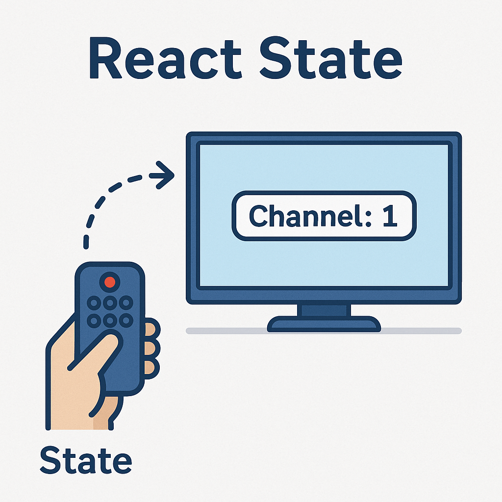

## 📌 ¿Qué es el estado (`state`) en React?

> El **estado** es una forma de hacer que un componente "recuerde" información entre renderizados. Es como una caja donde React guarda datos que pueden cambiar con el tiempo.

Por ejemplo, si estás construyendo un contador, un carrito de compras o una app de tareas, necesitas que la interfaz se actualice cuando el usuario interactúa. Ahí entra el **estado**.

Recordando:      

>✅ Un componente funcional en React es simplemente una función de JavaScript que retorna JSX.

Hay dos formas válidas de escribirlo:   

```jsx
// función declarada
function ComponenteX(){
    // lógica
    return()
};

export default ComponenteX;
```   

```jsx
// función expresada
const ComponenteY = () => {
    // lógica
    return()
};

export default ComponenteY;
```
   
---



El control remoto es el `state(estado)` y la tv es el `componente`

### 💬 ¿Cómo se declara el estado?

En componentes funcionales (los usados actualmente), usamos el **hook `useState`** para declarar y manejar el estado.
*(Asegúrate de importar `useState` desde React)*

```jsx
import React, { useState } from 'react';
```

---

### 🛠 Ejemplo básico: contador

```jsx
import React, { useState } from 'react';

function Contador() {
  const [contador, setContador] = useState(0); // valor inicial: 0

  const incrementar = () => {
    setContador(contador + 1);
  };

  return (
    <div>
      <h2>Contador: {contador}</h2>
      <button onClick={incrementar}>Sumar</button>
    </div>
  );
}
```

🔍 **¿Qué pasa aquí?**

* `useState(0)` → define una variable `contador` con valor inicial `0`.
* `setContador` → es la función que actualiza ese estado.
* Cada vez que llamas `setContador`, el componente se vuelve a renderizar con el nuevo valor.

---

### 🎯 ¿Dónde se usa el estado?

El estado se usa cuando:

* Querés actualizar la interfaz en tiempo real.
* Necesitás manejar datos temporales que cambian (como formularios, clicks, datos de usuario, etc.).
* Tenés que controlar cosas como abrir/cerrar menús, mostrar mensajes condicionales, etc.

---

### 🤯 Diferencia entre `props` y `state`

| Propiedad (`props`)                              | Estado (`state`)                        |
| ------------------------------------------------ | --------------------------------------- |
| Se pasa desde el padre al hijo                   | Se maneja dentro del componente         |
| Es inmutable (no se puede cambiar desde el hijo) | Es mutable con `setState` o `setXxx`    |
| Ideal para configurar el componente              | Ideal para manejar interacción/dinámica |

---
### 🎣 ¿Qué es un hook en React?

> ** ⚓ Un hook es una función especial que nos permite “enganchar” lógica de React (como estado, efectos, contexto, etc.) dentro de un componente funcional.**

React introdujo los hooks a partir de la versión **16.8** para permitir usar características como `state`, `lifecycle methods`, `context`, etc., **sin tener que usar componentes de clase**.

---

### 🧠 ¿Qué problemas resuelve un hook?

Antes de los hooks, para usar `state` o lógica de ciclo de vida (`componentDidMount`, etc.) había que escribir **componentes de clase**, que son más verbosos.
Con los hooks ahora podemos:

* Usar **estado (`useState`)**
* Ejecutar efectos secundarios como peticiones o timers (`useEffect`)
* Compartir lógica entre componentes (`custom hooks`)
* Usar otras características avanzadas de React con menos código

---

### 💡 Pensalo así:

> React te da funciones mágicas llamadas *hooks*, y vos las usás para conectar tu componente con cosas internas de React: el estado, los efectos, el contexto, etc.

---

### Ejemplo básico:

- usando componente de clase:  

```js
import React, { Component } from 'react';

class Contador extends Component {
  constructor(props) {
    super(props);
    this.state = {
      count: 0 // estado inicial
    };
  }

  incrementar = () => {
    this.setState({ count: this.state.count + 1 });
  }

  render() {
    return (
      <div>
        <p>Contador: {this.state.count}</p>
        <button onClick={this.incrementar}>Sumar</button>
      </div>
    );
  }
}
export default Contador;
```

- usando el hook `useState`:

```js
import { useState } from 'react';

function Contador() {
  const [count, setCount] = useState(0); // ← usando el hook

  return (
    <div>
      <p>Contador: {count}</p>
      <button onClick={() => setCount(count + 1)}>Sumar</button>
    </div>
  );
}
```

---

### Resumen:

| Característica                            | Hook                     |
| ----------------------------------------- | ------------------------ |
| Manejar estado                            | `useState`               |
| Efectos secundarios (fetch, timers, etc.) | `useEffect`              |
| Acceder al contexto                       | `useContext`             |
| Refs a elementos                          | `useRef`                 |
| Memorizar valores/fn                      | `useMemo`, `useCallback` |

---


